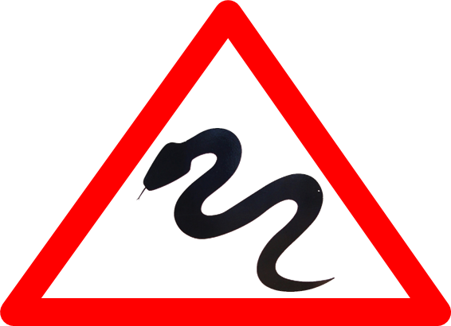

.. Python Code Patterns documentation master file, created by
   sphinx-quickstart on Fri Jul 25 15:49:10 2014.
   You can adapt this file completely to your liking, but it should at least
   contain the root `toctree` directive. 

***************************************
The Little Book of Python Anti-Patterns
***************************************

|
|

|
|

:github_badge:`quantifiedcode/python-anti-patterns`

Welcome, fellow Pythoneer! This is a small book of Python  **anti-patterns** and **worst practices**.

Learning about these anti-patterns will help you to avoid them in your own code and make you
a better programmer (hopefully). Each pattern comes with a small description, examples and
possible solutions.

Why did we write this?
----------------------

**Short answer**: We think that you can learn as much from reading bad code as you can from reading good one.

**Long answer**: There is an overwhelming amount of Python books that show you how to do things by focusing on 
best practices and examples of good code. There are only very few books out there that show you how **not** to do things. We wanted to change that by providing you with an **anti-book** that
teaches you things which you should **never** do in practice. 

Who are we?
-----------

We're `QuantifiedCode`_, a Berlin-based startup. Our mission
is to help programmers write better code! Our first product is an `online tool`_ for
automated, data-driven code review. When building this tool we learned a lot about code quality
in Python and decided to compile our knowledge into this book.

.. _QuantifiedCode: https://www.quantifiedcode.com/
.. _online tool: https://www.quantifiedcode.com/

How is this book organized?
---------------------------

We tried to categorize each anti-patterns into one of the following categories:

* **Correctness**: Anti-patterns that will literally break your code or make it do the wrong things.
* **Maintainability**: Anti-patterns that will make your code hard to maintain or extend.
* **Readability**: Anti-patterns that will make your code hard to read or understand.
* **Performance**: Anti-patterns that will unnecessarily slow your code down.
* **Security**: Anti-patterns that will pose a security risk to your program.

Many of the patterns do of course belong in more than one of these categories, so please don't take
the choice that we've made too serious. If you think a pattern is grossly misplaced in its category,
feel free to `create an issue`_ on Github.

.. _`create an issue`: https://github.com/quantifiedcode/python-anti-patterns/issues

References
----------

Whenever we cite an anti-pattern from another source we tried including the link to the original
article on the bottom of the page. If you should have missed one, please feel free to add it
and make a pull request on Github. Thanks!

Licensing
---------

This document is licensed under a creative-commons NC license, so you can use the text freely
for non-commercial purposes and adapt it to your needs. The only thing we ask in return is the
inclusion of a link to this page on the top of your website, so that your readers will be able to
find the content in its original form and possibly even contribute to it.

Contributing
------------

If you think this collection can be improved or extended, please contribute! You can do this by
simply forking our Github project and sending us a pull request once you're done adding your changes.
We will review and merge all pull requests as fast as possible and be happy to include your name on
the list of authors of this document.

List of Maintainers
-------------------

For a full list of contributors, please look at `Github`_. If you have any
questions concerning this project or contributions, please contact one of the maintainers:

* `Andreas Dewes`_
* `Christoph Neumann`_

.. _`Github`: https://github.com/quantifiedcode/python-anti-patterns/graphs/contributors
.. _`Andreas Dewes`: https://github.com/adewes
.. _`Christoph Neumann`: https://github.com/programmdesign

Index Of Patterns
-----------------

Here's the full index of all anti-patterns in this book.

.. toctree::
    :glob:
    :maxdepth: 2

    maintainability/index
    readability/index
    security/index
    performance/index
    correctness/index
